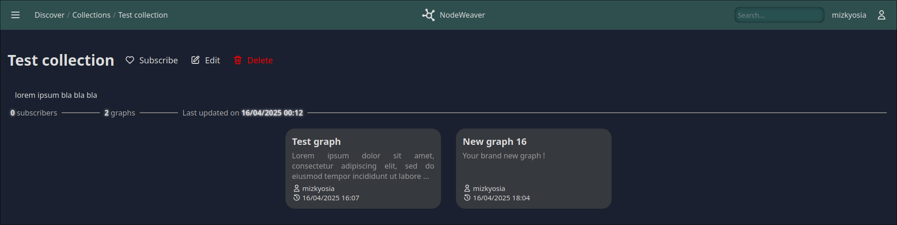

<div align="center" style="margin: 20px;">

</div>

> By Léo Lewandowski, Victor Dumortier, Sasha Le Roux & Pierre Butez

- [Guide](#guide)
  - [Website tour](#website-tour)
    - [Login / Signup](#login--signup)
    - [Home](#home)
    - [Account](#account)
    - [Discover](#discover)
    - [Graph](#graph)
    - [Collection](#collection)
    - [Profile](#profile)
    - [Miscellaneous](#miscellaneous)
      - [Collection preview](#collection-preview)
      - [Graph preview](#graph-preview)
  - [Editing app](#editing-app)
    - [View mode](#view-mode)
    - [Edit mode](#edit-mode)
- [Dependencies](#dependencies)
- [Credits](#credits)
- [How to run ?](#how-to-run-)
  - [Installing Docker](#installing-docker)
  - [Running](#running)
  - [Accessing the project](#accessing-the-project)

## Guide

NodeWeaver is a simple graph editing web-app. It is divided in 2 main parts :
- The editing app
- The website
  
The editing app is in itself a single web page included in the website, where you can edit your graphs, by modifying links, nodes & weights, as well as use pathfinding algorithms to find the most efficient path between 2 graph nodes.

In a nutshell, the website allows people to :
- Browse public graphs & collections
- Look at public accounts' publications
- If logged in : 
  - Browse restricted graphs & collections
  - Look at restricted accounts' publications
  - Create & publish graphs & collections

### Website tour

#### Login / Signup


Allows you to create an account, or log into an existing one

> [!TIP]
> The background animation is not a video, and is actively generated and simulated by the browser. This may cause a bit of lag on some machines unfortunately :(

#### Home


The heart of the website ! The Home page includes most of the important things for the user :
- Created graphs
- Created collections
- Subscribed collections
- Favorite graphs

This is also where you can create new collections & graphs.

On a global scale, this page aims to include most of the things the user would need quick access to

#### Account


This simple page allows you to edit your account's parameters (except your password)

> [!NOTE]
> There are 3 visibility parameters :
> - Public : anybody can see your profile (published graphs & collections, bio & username)
> - Private : your username is still visible to anybody, but everything else is hidden
> - Restricted : shows as a pubic profile to anybody logged into an account, and as a private profile to anyone else

#### Discover


The other important page of this website : the discover page allows you to search for any collection and/or graph

Additionnally, it shows you a short selection of the most recently edited graphs, the most favorited graphs and the most followed collections.

> [!NOTE]
> The 45 graphs displayed in the animation at the start of the page are randomly selected

#### Graph


Shows information about a specific graph, and allows you to favorite/unfavorite it, view it and add it to your collections.

If you are author of said graph, you will also be able to edit its name & description, or even delete it.

#### Collection



Shows information about a collection, as well as the graphs it contains. Allows for quick following/unfollowing of said collection. If you are the author of the collection, you can also rename it, change its description, change its visibility or even delete it.

#### Profile


Here you can see the public profile of an user. Their public graphs & collections are displayed, as well as their bio and username.

#### Miscellaneous

##### Collection preview 


Popup that shows a bit of information about a collection, and allows quick following/unfollowing of said collection, without redirecting you to another page

##### Graph preview


Popup that shows a bit of information about a graph, allows for quick collection adding/removing & quick favoriting/unfavoriting, without redirecting the user to another page

### Editing app

Any visitor of the website can vew a graph, without need for an account. However, editing a graph can only be done if you are its author, therefore requiring an account

#### View mode


The leftmost panel shows the current viewport parameters (zoom, pan), the graph nodes & graph links, with the selected ones highlighted in green

The center panel is where the magic happens : the graph render. This is a 2d scene where you can zoom (touchpad pinch or `ctrl` + scroll), pan (2d scroll with touchpad, regular scroll and `shift` + scroll with mouse) and click on nodes / links to select them. \\
Selecting a node will highlight links going **out from this node** with a green/gray gradient.

The rightmost panel is used for pathfinding (cost only, no flows), displaying the node choices, algorithm choices and total cost of the found path. The links used for pathfinding are dashed, and animated in the direction of the path.

If you are the author of the graph, you can enter Edit mode using the button on the right

#### Edit mode 


In edit mode, the leftmost panel does not change much, except for the fact that any displayed value can be edited : node names, positions, edge costs...

The center parnel controls do not change neither, you can still select nodes and move around like usual.

The rightmost panel's pathfinding is replaced by a tool selection :
- Select : Allows you to select nodes, and move all selected nodes by dragging a node from the graph
- Add nodes : Disables selection, clicking on any part of the graph will create a new node at the position of said click event
- Link nodes : Allows you to create (directed) links between 2 nodes, by clicking on the first node (from) and then the second node (to)
- Delete : Clicking on a node or a link deletes it

You can also save your changes to the graph in the database

## Dependencies

Our chosen framework is [SvelteKit](https://svelte.dev/), which is itself based on [Vite](https://vite.dev/) and developped by Svelte.

For the database, we use a MySQL docker container, and the NodeJS package [Prisma](https://www.prisma.io/) to simplify database requests & schema building

To simplify styling and CSS rules, we used [Sass](https://sass-lang.com/), a CSS extension (meaning it is 100% compatible with regular CSS) to make it easier to style components

Additionnally, we use [Docker](https://www.docker.com/) to manage our project, because it ensures compatibility on all devices.

Other used packages are [argon2](https://www.npmjs.com/package/argon2) and [oslojs](https://oslojs.dev/) for password hashing & checking, as well as a simple [email-validator](https://www.npmjs.com/package/email-validator)

## Credits 

The account & session system was heavily inspired by [Lucia](https://lucia-auth.com/) tutorials on authentication

All icons are either made by us or taken from [SVG Repo Dazzle Line Icons](https://www.svgrepo.com/collection/dazzle-line-icons)

## How to run ?

> [!IMPORTANT]
> For the start of the project launch, you'll need an internet connection

### Installing Docker

This project uses [Docker](https://www.docker.com/), to ensure compatibility on all devices. As such, you need to install it before running the project.

If you're using the Docker CLI, you'll need to configure its user groups and permissions before continuing. I recommend searching tutorials for installing & configuring the Docker CLI for your OS

Then, you need to clone this repo :

```sh
git clone https://github.com/mizkyosia/NodeWeaverPro3000Plus.git
```

### Running

Open a terminal instance (`cmd` on Windows)

Move the current context to the project's directory :
```sh
cd path/to/NodeWeaverPro3000Plus
```

Pull the necessary images from DockerHub :
```sh
docker compose pull
```

Build the containers :
```sh
docker compose build
```

> [!NOTE]
> These 2 previous instructions must only be done once (unless you actively modified the project's source code)
> 
> Additionnally, from this point on, you can run the project without an internet connection as everything needed is hosted locally on your machine

Then, you can run the project like so :
```sh
docker compose up
```

If you wish to relaunch the project again, only the last step is needed

### Accessing the project

You can access the project using `http://localhost:<NODE_DOCKER_PORT>`, where the `NODE_DOCKER_PORT` value is the one declared in the `.env` file at the root of the project.

Most likely, this will be [localhost:3000](http://localhost:3000/)

> [!CAUTION]
> On rare occasions, the database can be initialized without any data inside of it. If this occurs, follow these steps : 
> 1. Launch the containers `docker compose up`
> 2. Open [Adminer](http://localhost:8080/)
> 3. Log in using user `root` and the password & db name defined in the `.env` file
> 4. Click import
> 5. Select the file `database/data.sql`
> 6. Import it
> 7. Relaunch the containers using `docker compose up --build`
> 
> Normally, the database should be all good now !